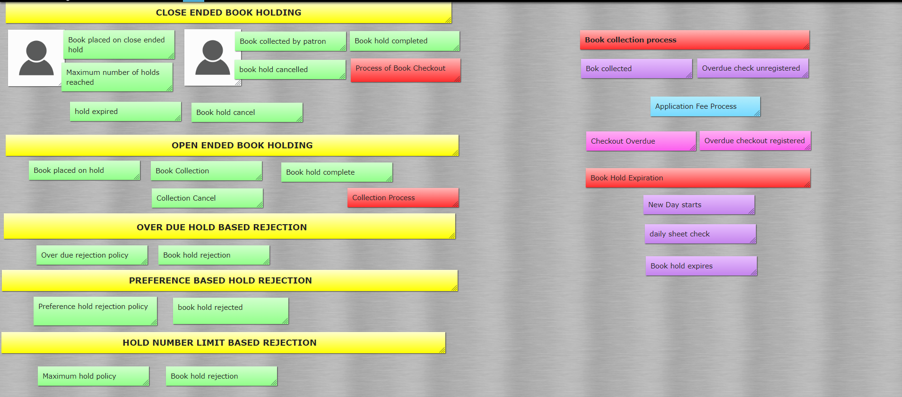
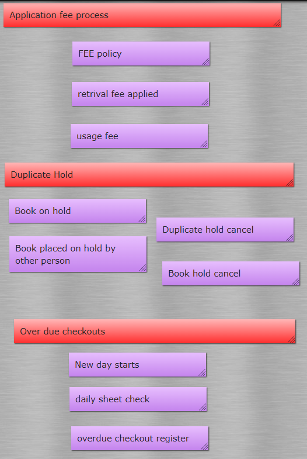
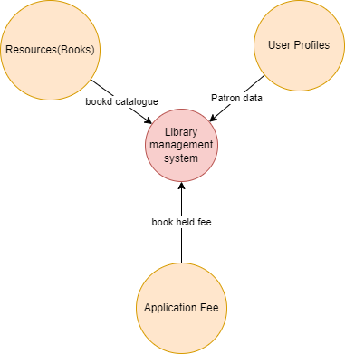
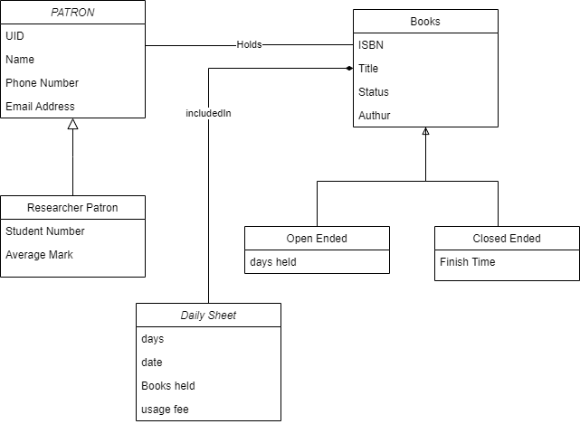
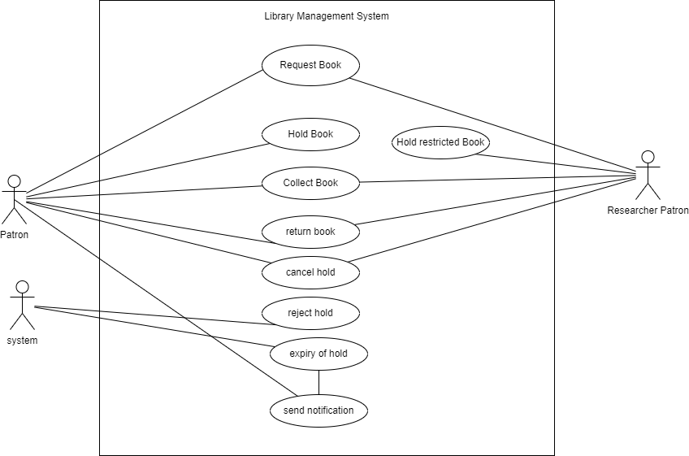
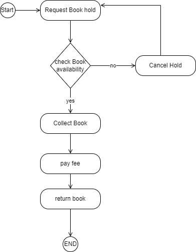

# LibraryManagamentSystem
This project is a small console based library management system application. 
# Domain Background
At its numerous library branches, a public library allows its users to place books on hold. Only one customer may place a hold on any particular set of available books at any given moment. There may be retrieval or usage costs for books that are either limited or circulated. Only a researcher patron may check out a restricted book. Regular users are only permitted five holds at a time, but researchers are permitted an infinite amount of holds. Until the customer checks out the book, an open-ended book hold is in effect. At that point, it is finished. A closed-ended book hold will expire if it is not finished within a predetermined period of time after it was requested. At the start of each day, this check is performed by looking at the daily document with expiring holdings. An open-ended hold time can only be requested by researchers. If a user attempts to place a hold at the same library branch with more than two late checkouts, their request will be rejected. A book may be borrowed for as long as 60 days. Examining the daily sheet with the overdue checkouts allows one to check for overdue checkouts. Look at the patron profile to interact with your existing holds, checkouts, etc. The information in the patron profile is specific to one person and is not always updated daily, despite the fact that it looks like a daily sheet.
How does a customer actually know which books are available for loan? The library contains a book catalogue where books are uploaded together with their unique instances. Only if there is already a book in the catalog with the same ISBN may a particular book instance of a book be added. Both the book's title and price must not be empty. We choose whether an instance will be currently circulating or Restricted at the time of introducing it. This permits us to simultaneously have a book with the same ISBN that is disseminated and limited.
# Assumptions
The process starts with exploring the domain with the help of Big Picture Event storming. After having an event storming session there were many discoveries made:
 
 
# Definitions
Fromt the event stroming session following definitions were discovered:
## Patron
a person who lends a book from library
## Available Book
a book that can be placed on hold
## Restricted Book
a book which can be held by researcher patron only
## Book on hold
a book which is held by a patron currently
## Collected Book
a book which is succesfuly collected by a patron
## Catalogue
Set of books
## Hold Duration
the time period in which a book can be held
## Checkout
colleciton of book from library
## Overdue Checkout
an overdue occurs when a patron doesnt return the book he held after 60 days of colleciton
## daily sheet
a sheet that contains data of expired hold
# Domain Mapping
The following domain mapping has been developed after event stroming session. The main core domain is Library resource management and the subdomains include resorces, users profiles and application fee domain.

# UML
UML is unified modelling language that is used for visually representing the system being developed. 
## Class Diagram
A description of a group of objects all with similar roles in the system, which consists of: structural featurs as attributes and behavioural features as operations in it. Here is the class diagram of the library management system. 

## Usecase diagram
In the Unified Modeling Language (UML), a use case diagram can summarize the details of your system's users (also known as actors) and their interactions with the system. Here is the use case diagram of the library management system.

## Activity Diagram
Activity diagram is another important behavioral diagram in UML diagram to describe dynamic aspects of the system. Activity diagram is essentially an advanced version of flow chart that modeling the flow from one activity to another activity.Here is the activity diagram of the library management system. 

# METRICS
## SONARCUBE
### Complexity
It is the Cyclomatic Complexity, which is determined by the quantity of code pathways. The complexity counter is increased by one each time a function's control flow divides into two separate directions. Each function has a complexity that is at least 1. Because keywords and functionalities differ between languages, this computation differs a little bit.
### Security
It includes the number of vulnerbailities in the system and how they are handle in te project.
